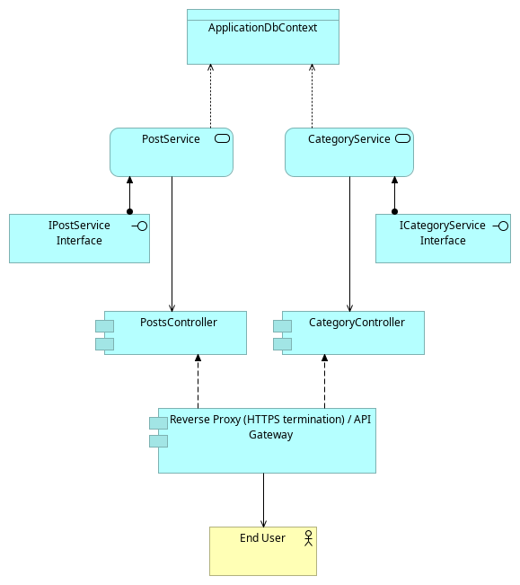
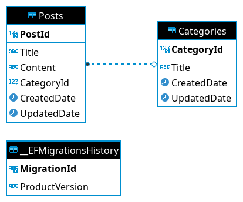

# Forum backend

VSCode development docker container has been setup.

Build & run:
```bash
dotnet build

dotnet run --project social-platform-2000-backend/social-platform-2000-backend.csproj
```
Create a new database migration:
```bash
dotnet-ef migrations Add --project social-platform-2000-backend/social-platform-2000-backend.csproj -o DataAccessLayer/Migrations <name_of_migration>
```

Update the database with the migration(s):
```bash
dotnet-ef database update
```

# Architecture



# Database Diagram

