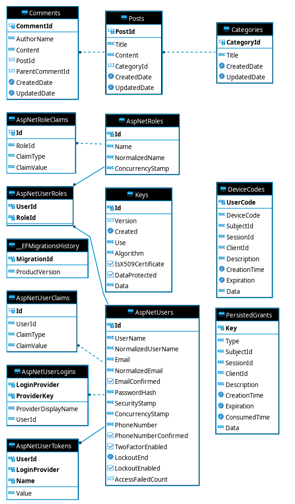

# Forum backend

VSCode development docker container has been setup.

Run:

```bash
./develop.sh
```

Create a new database migration:

```bash
dotnet ef migrations add "<name_of_migration>" --project sp2000.Infrastructure --startup-project sp2000.API --output-dir sp2000.Infrastructure\Persistence\Migrations
```

Update the database with the migration(s):

```bash
dotnet-ef database update --project sp2000.API/sp2000.API.csproj
```

# Architecture


# Database Diagram



# Common problems

Red squiggly lines everywhere, VSCode -> <CTRL + SHIFT + P> restart omnisharp, the language server.
